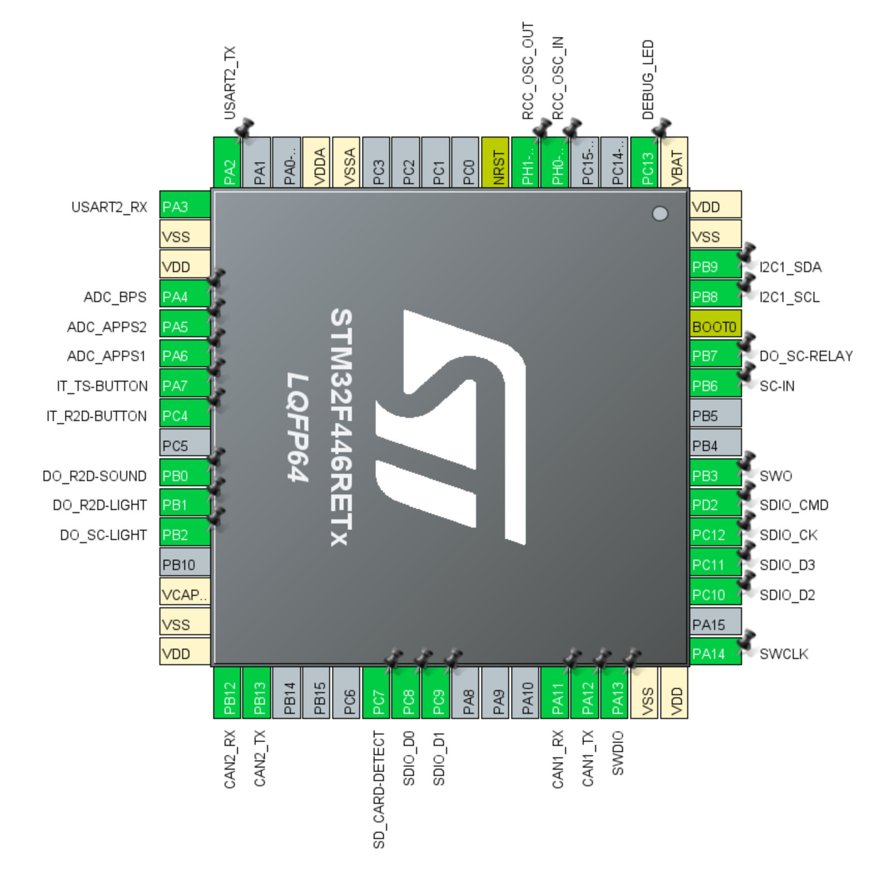

# Vehicle Control Unit (VCU)

Device responsible of the TS activation logic and R2D mode

_The PCB design is still under testing and may change in the future._ 

## Features

- Based on STM32446RET6
- 180 MHz core clock
- 8 MHz crystal oscillator
- SD Card for data logging
- I2C OLED Display for debugging
- LV CAN Transciver for telemetry
- Isolated CAN Transciever for TS inverter commands and AMS comms
- STLINK, Trace Synchronous Sw for Debug
- UART for dash comms or debugging

## Functional Description

### 1. TS Inactive:

- **System Off:** High-voltage system deactivated for safety.
- **Transition:** Activates after safety checks are completed.

### 2. TS Active:

- **System Powered, Not Drivable:** High-voltage on, no torque output.
- **Transition:** Requires driver readiness (brake pressed + R2D button)

### 3. R2D (Ready to Drive):

- **Operational:** Torque output enables based on throttle input.
- **Transition:** Returns to inactive or active on error or driver command.

## Software Design Notes

- Using FreeRTOS with CMSIS V2 interface for easy multitasking and timers
- 

## TO-DOs

- [x] task1
- [ ] task2
- [ ] task3
- [ ] task4

## Connections and Peripherals List

### Pinouts

### Peripherals

1. **CAN1**: TS CAN
2. **CAN2**: LV CAN
3. **I2C**: OLED Display
4. **SDIO**: SD Card
5. **UART**: Dash Comms / Debug  

### Analog Inputs (ADC)

1. **APPS 1**
2. **APPS 2**
3. **BPS (Brake Pressure Sensor)**

### Digital Inputs (All are falling edge interrupts)

1. **SC Voltage**: To check if SC is opened (Need internal pulldown) - _EV4.11.8_
2. **TS Activate/Deactivate Button**: - _EV4.11.2_
3. **R2D Activate Button**: - _EV4.11.7_

### Digital Outputs (All are active HIGH):

1. **Debug LED**: Onboard LED for debugging
2. **R2D Sound**: Connected to the the R2D buzzer - _EV4.12.1_
3. **SC Relay**: Connected to the onboard SC Relay - _Activation logic relay in SC_
4. **SC Fault**: Detects if SC is triggered
5. **R2D Indicator**: Light to the dashboard to indicate in R2D mode 

